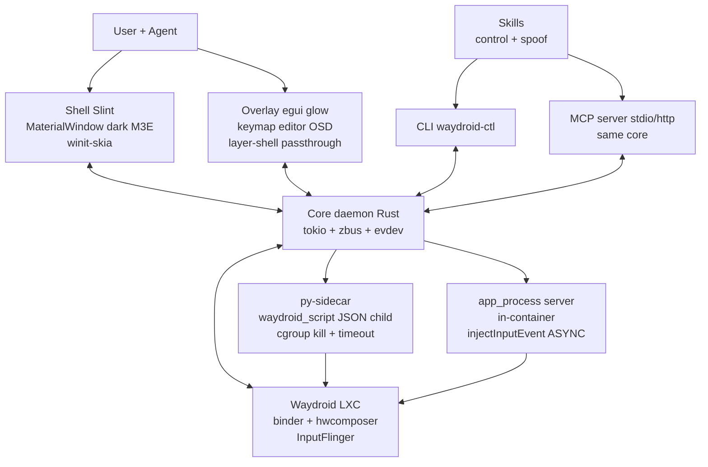
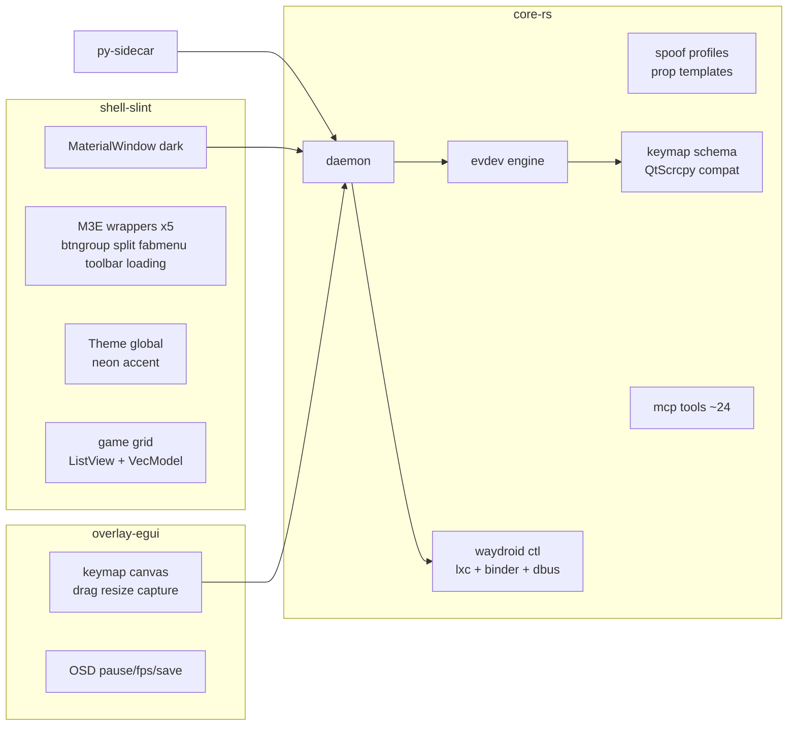
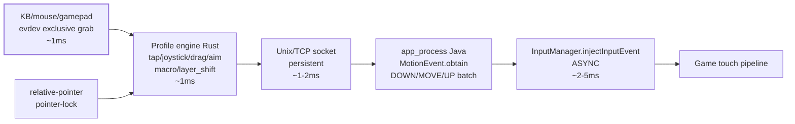
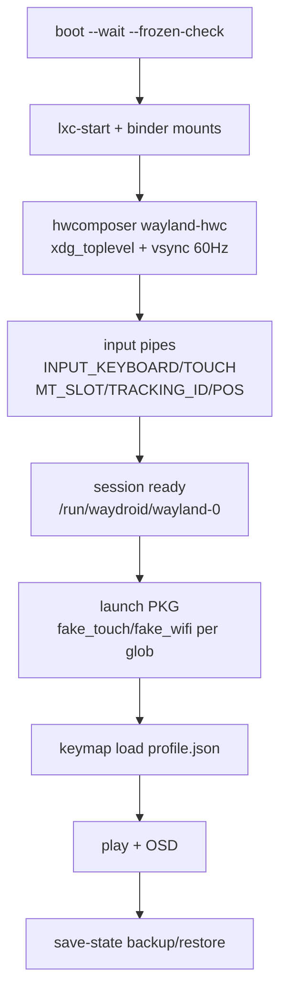
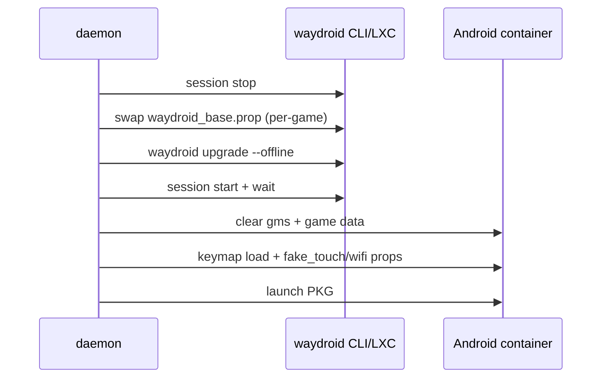
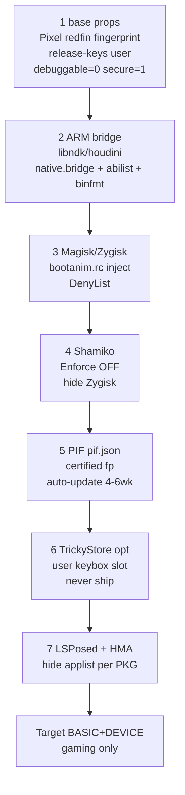
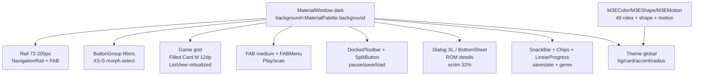
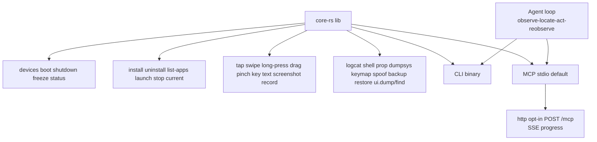

# Proposed stack — full system + flows

Date: 2026-09-14. Target: Linux Wayland, Waydroid LXC backend, gaming.
Refs: `.research/00-overview-decision.md:1`, `.research/01-slint-ui.md:1`, `.research/02-material-expressive.md:1`.

## Stack table

| Layer | Choice | Why | Reuse |
|---|---|---|---|
| Core/daemon/CLI/MCP | Rust workspace, tokio, zbus, evdev, wayland-client, gilrs | 42ms start, static bin, no GC pause aim path | phantom engine+profiles |
| Shell UI | Slint 1.17, `MaterialWindow` dark + custom Theme, `winit-skia` | only beautiful+Wayland+a11y today | official M3 lib MIT, 52 comps |
| Expressive gap | 5 in-repo wrappers | official M3 = baseline only | react-material-expressive tokens |
| Overlay/keymap editor | egui glow sidecar, layer-shell passthrough | 5.6MB LTO, 0.1-0.3s start, drag-keys win | — |
| Input inject | host evdev grab → JSON profile → socket → `app_process` `injectInputEvent ASYNC` | 5-10ms, persistent socket | phantom `android_socket`, scrcpy pattern |
| Waydroid installs | py-sidecar calls `waydroid_script` JSON | don't rewrite installer | waydroid_script, libndk/houdini |
| Spoof store | `waydroid_base.prop` per-profile swap + `waydroid prop set` | canonical persistent overrides | Waydroid-total-spoof prop list |
| Root/hide | Magisk/Zygisk → Shamiko → PIF → TrickyStore(user keybox) → LSPosed+HMA | BASIC+DEVICE gaming target | PIF fork, TrickyStore, HMA |
| AI face | CLI+MCP same core, stdio default, http opt-in, ~24 tools | no replay drift | waydroid-mcp lessons |
| Skills | `waydroid-control` + `waydroid-spoof` SKILL.md | observe→locate→act→re-observe | — |

Non-goals v1: no STRONG promise, no shipped keybox, no sensor/GPU fake, no CV smart-key.

## System overview



## Workspace crates



## Input hotpath (FPS-critical)



Latency budget: evdev 1 + profile 1 + socket 1-2 + inject 2-5 = 5-10ms. Display round-trip dominates. Never `adb shell input` per-frame (200-1000ms spawn). Never `dispatchGesture` for FPS look.

Fallbacks: uinput MT device (`persist.waydroid.uevent`, fragile restart) → Wayland native forward (`fake_touch` per package, best native KB games) → macros only via adb.

## Waydroid mgmt + session flow





Prop files: `/var/lib/waydroid/waydroid_base.prop` canonical, `/var/lib/waydroid/waydroid.cfg` alt, runtime `waydroid prop set persist.waydroid.*`, images `system.img/vendor.img/rootfs/data/*`.

## Spoof + root/hide layers (order matters)



Root toggle: enable = ensure `bootanim.rc` Magisk block + restart; disable = restore `original_bootanim`, purge `overlay*/magisk*`, clear `/data/adb/magisk.db`. Prefer per-app DenyList+Shamiko blacklist+HMA template over global off.

Verify: YASNAC, Play Integrity Checker, Applist Detector. Known gap v1: SwiftShader/ANGLE GPU string, zero-noise sensors, fixed battery.

## Shell UI tree (Slint)



Motion approx (no Slint springs): spatial `ease-out-back` 350ms, effects `ease-in-out` 150-250ms, shape morph animate `border-radius`. Density 32-40px desktop (not 48dp touch). Backend `SLINT_BACKEND=winit-skia`. Tray 1.17 `SystemTrayIcon`.

## CLI + MCP same core



Tools ~24: `device.list/boot/status, app.install/uninstall/start/stop/list, activity.current, input.tap/swipe/key/text, vision.screenshot/stream, ui.dump/find, shell.exec, file.push/pull, logcat.dump/start/stop, prop.get/set, keymap.load, spoof.load`. Screenshot returns MCP `image` base64 + `android://device/frame/latest.jpg` @2FPS. Logcat handle + poll + redact tokens.

## Build/packaging

```mermaid
graph LR
  CR[cargo build] --> DEB[cargo-deb]
  CR --> RPM[rpmbuild]
  CR --> PKG[PKGBUILD]
  CR --> FL[flatpak freedesktop rust ext]
  CR --> MUSL[static musl<br/>300KB-2MB bin]
  SL[slint-build<br/>@material library_paths] --> CR
  PY3[py-sidecar<br/>supervised child] --> CR
```
